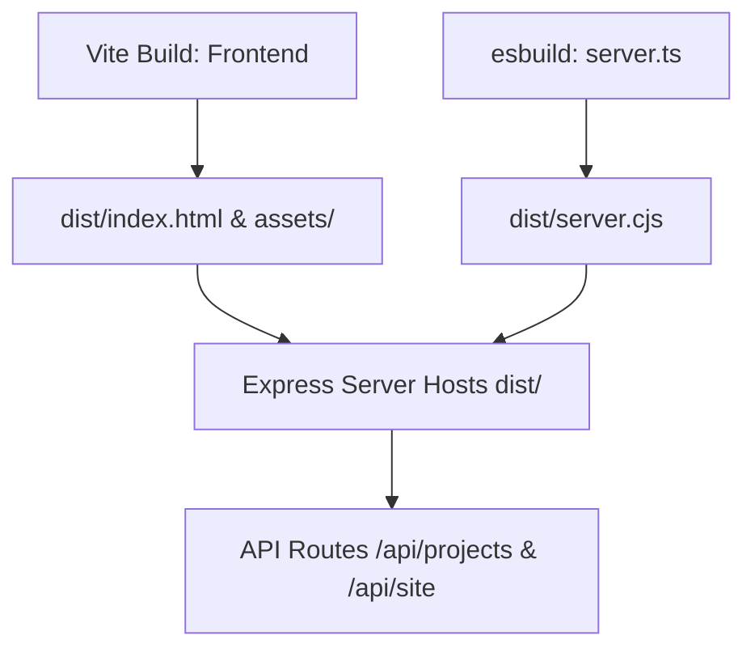

# AI Handoff Specification (AI_HANDOFF)

Welcome, AI Coding Assistant! Read this document to instantly align with the project design, code conventions, and architectural constraints.

---

## 1. Project At A Glance

- **Project Name**: Anshay Basene Portfolio & Studio Manager
- **Core Stack**: React 19 (SPA) + TypeScript + Vite 6 + Tailwind CSS v4 + Express (Node.js)
- **Primary Mission**: Showcase cinematic video edits and high-impact graphic design work, convert visitors via pricing estimation tools, and allow content CRUD operations via a passcode-protected admin portal.
- **Passcode**: **`anshayadmin`** (or **`admin`**)

---

## 2. Key Architecture Controls

### Critical Constraints:
1. **Persistent Filesystem Required**: The backend writes site data directly to local flat JSON files inside `backend/data/site-db.json` and `projects-db.json`. When deploying, you **MUST** use a platform supporting persistent disk volumes (e.g. Render with a mounted volume at `/backend/data`) or a Linux VPS. Serverless deployment (e.g. Vercel) will lose database changes.
2. **Double DB Sync**: When saving data, the Express server writes to the database files inside `/backend/data/` and copies them to the `/frontend/src/data/` folder as a local build fallback. Ensure this synchronization code in `server.ts` is never removed.
3. **Adaptive Performance Motion**: All visual transitions are tied to the custom `usePerformance()` hook context:
   - **Lite/Reduced Mode**: Opacity fades only, no springs, layout animations, blurs, shadows, or Lenis smooth scrolls.
   - **Balanced/Full Mode**: Allows springs, Lenis scroll, hover scales, and projection card tracking.

---

## 3. Tech Stack Reference

- **Frontend**: React 19, Vite 6, Tailwind CSS v4, Lucide React, Framer Motion (`motion/react`)
- **Backend**: Node.js, Express, TSX, esbuild (for server builds)
- **Database**: flat-file JSON
- **Animation System**: Lenis (smooth scroll) + GSAP/ScrollTrigger + custom responsive performance Manager hook.

---

## 4. Coding Standards & Conventions

### 1. Style Rules
- Standardize on Tailwind CSS v4 utility classes.
- Use dynamic inline style maps only when passing variables (like theme color parameters, e.g. `currentTheme.accentHex`).

### 2. Performance Rules
- **No Reflow Animations**: Never transition layout-altering CSS keys (`width`, `height`, `top`, `left`, `margin`, `padding`). Animate only `transform` (scale, translation offsets) and `opacity`.
- **FAQ Collapser**: Do not animate `height` in mobile/lite modes.
- **Vite Bundler Warning**: Maintain code chunk divisions and ensure clean imports to avoid circular dependency chains.

### 3. File Upload Guards
- Multer settings in `server.ts` restrict portfolio image uploads to PNG, JPEG, JPG, and WEBP only, with a maximum size limit of **5MB**.
