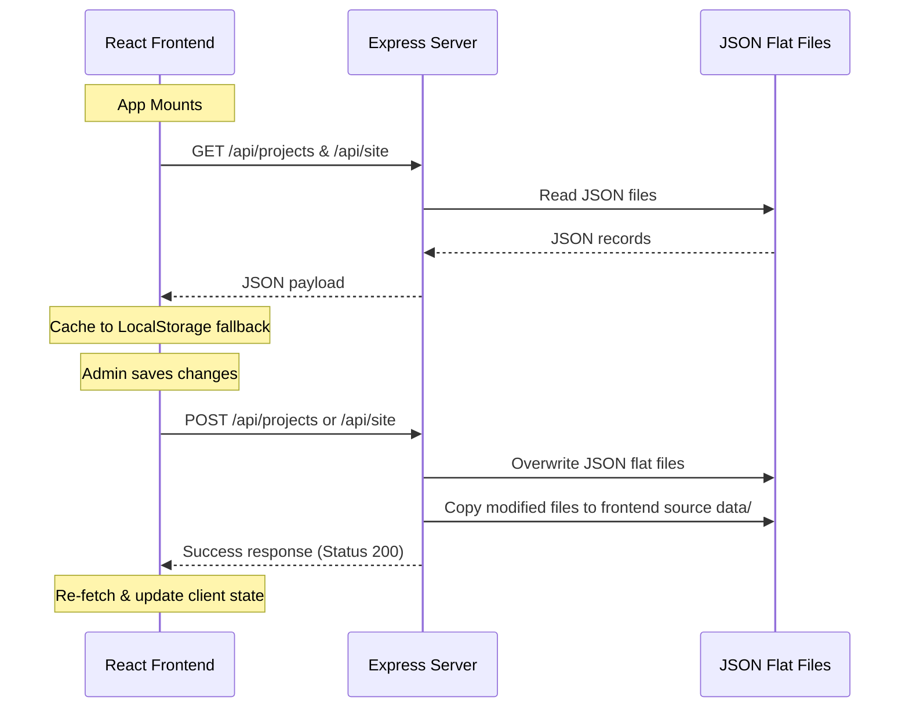

# Architectural Specification

This document details the software architecture, data flow, and directory structure of the portfolio codebase.

---

## 1. Directory Structure

```
anshay-basene-portfolio/
├── backend/                  # REST APIs & Local Database
│   ├── data/                 # Flat-file JSON databases
│   │   ├── projects-db.json  # Projects registry (up to 20 slots per format)
│   │   └── site-db.json      # Dynamic website texts & video progressions
│   ├── uploads/              # Project visual assets folder
│   └── server.ts             # Express application entry point
├── frontend/                 # Client Interface (React/TS)
│   ├── src/
│   │   ├── components/       # Interface components (Hero, Navbar, Showcase...)
│   │   ├── data/             # Static configurations & JSON fallbacks
│   │   ├── motion/           # Performance Motion System
│   │   │   ├── deviceDetection.ts
│   │   │   ├── animationConfig.ts
│   │   │   ├── performanceManager.tsx
│   │   │   ├── heroAnimations.ts
│   │   │   ├── scrollAnimations.ts
│   │   │   ├── hoverAnimations.ts
│   │   │   └── pageTransitions.ts
│   │   ├── App.tsx           # Layout assembler
│   │   └── main.tsx          # Client-side renderer
│   ├── index.html            # Main markup page
│   └── vite.config.ts        # Vite configuration (assets routing)
├── dist/                     # Compiled Production Bundles
│   ├── assets/               # Bundled assets (CSS, JS)
│   └── server.cjs            # Bundled Node.js Express server
├── package.json              # Shared scripts & dependencies
└── tsconfig.json             # Root TypeScript config
```

---

## 2. Data Flow & Sync Mechanisms

The application does not require a heavy relational database, relying instead on a high-speed flat-file JSON storage architecture.



---

## 3. Build & Compilation Pipelines

The workspace is compiled into the static production directory `/dist` using two specialized bundlers:

1. **Frontend Compilation**:
   - Compiles React JSX and TypeScript code via **Vite** using Rollup under the hood.
   - Outputs minified JavaScript chunks and CSS assets to `dist/assets/` and copies `index.html` to `dist/index.html`.
2. **Backend Compilation**:
   - Bundles the Express server and its TypeScript files via **esbuild** into a single target file `dist/server.cjs` targeting Node.js execution.
