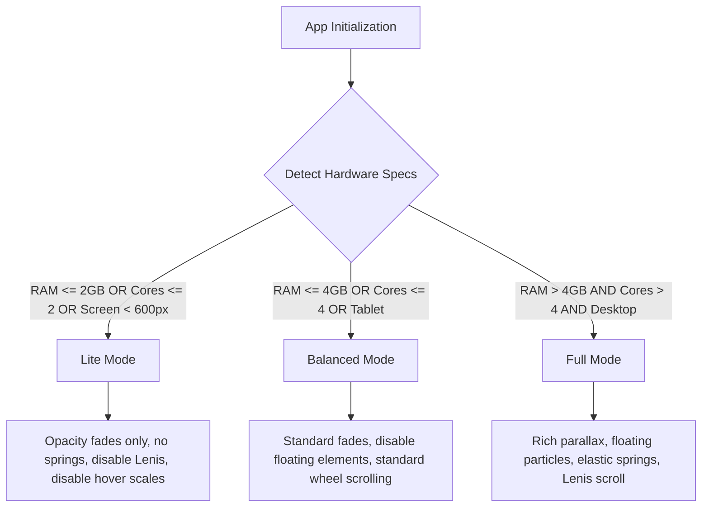

# Performance Optimization Specifications

This document outlines the performance optimization strategies implemented to ensure a premium, fast experience across all device ranges, from high-end workstations to budget mobile phones.

---

## 1. Adaptive Performance Motion System

To prevent frames from dropping below the target rate (60 FPS on desktop, 30 FPS minimum on low-end mobile), the frontend implements a hardware-aware adaptive animation system.

### Motion System Rules Applied:
- **Only animate `transform` and `opacity`**: Any layout-shift properties (such as `width`, `height`, `top`, `left`, `margin`, `padding`) are strictly avoided inside transitions.
- **Intersection Observers**: Animates components only when they enter the viewport using Framer Motion's `whileInView` configuration.
- **Throttled Listeners**: Continuous loops and listeners (like timecode calculations) are throttle-bound or disabled on low-power devices.

---

## 2. Rendering Optimization

1. **YouTube API Player Lifecycle**:
   - YouTube Players in `BeforeAfter.tsx` are instantiated *only* when the Before/After tab is active, and are completely destroyed (`player.destroy()`) when leaving the section.
   - Prevents running inactive cross-origin iframe process trees in the background.

2. **Framer Motion Layout Isolation**:
   - Showcase grids filter project items instantly.
   - Instead of running layout projection triggers on all list cards, which invalidates browser layout grids, `layout={isLiteMode ? false : "position"}` isolates transform changes, completely eliminating reflow jank.

---

## 3. Assets & Image Loading

- **Image Formats**: Use `.webp` or `.avif` for case thumbnails.
- **Lazy Loading**: All thumbnail cards inside the showcase list carry `loading="lazy"` attributes, meaning off-screen images do not compete for network bandwidth during initial loading phases.
- **Web Font Optimization**: System fonts are preferred or pre-connected to avoid Flash of Unstyled Text (FOUT).
